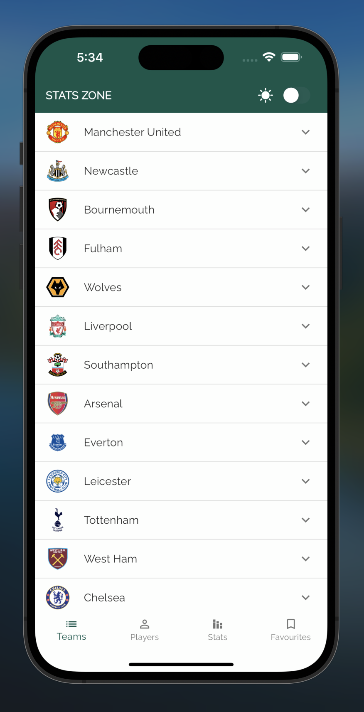
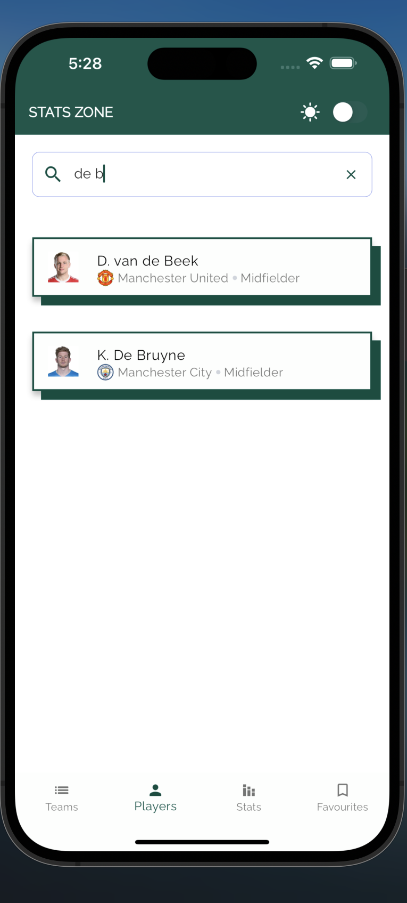
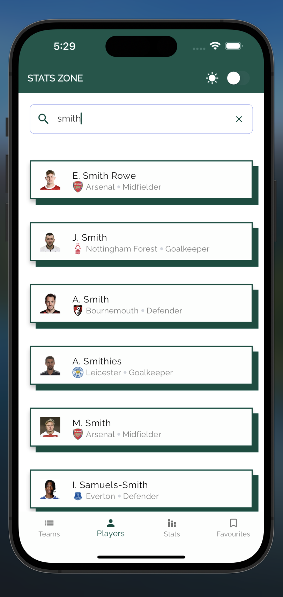
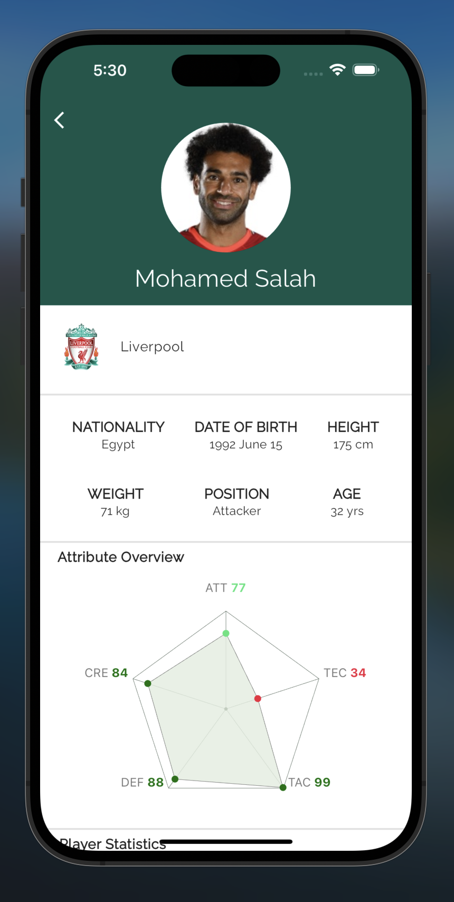
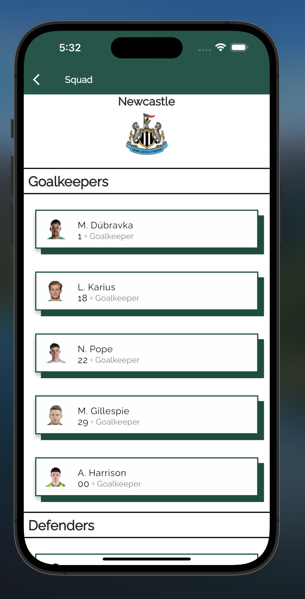
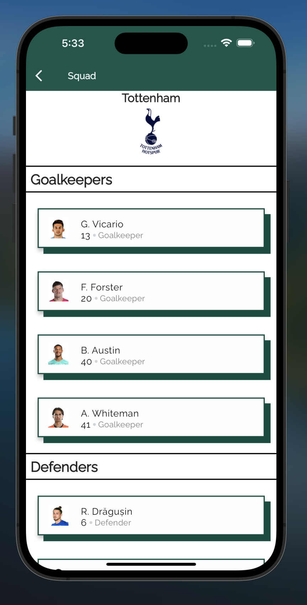

# Stats Zone

A Flutter application that helps users track statistics and data for English Premier League's teams, players, squad information, etc. 

Stats Zone is a mobile application utilises data from the [RapidAPI Football](https://rapidapi.com/api-sports/api/api-football/). The power of Dart & Flutter along with vital packages indicated below, has been harnessed to bring this product to life. Inspiration for the design is in most part from the official Premier League app.

#### Major Packages used:
- Flutter Riverpod (State Management)
- Go-Router (Routing)
- Google Fonts
- Dio (Networking)
- Cached Network Image (Image Caching)
- FL Chart (Customised Graphs)
- Flex Color Scheme

### Installation

**1. Clone the Repository:** Open your terminal and clone the "Stats Zone" repository to your local machine:

```sh
$ git clone https://github.com/dubemezeagwu/stats_zone
```

**2. Navigate to the Project Folder:** Change your working directory to the project folder:

```
$ cd stats_zone
```

**3. Install the Dependencies:** Install the project's dependencies using **pub** (Dart Package Manager):

```sh
$ flutter pub get
```

### Usage

To run and use the application, ensure you have either an emulator or a mobile device connected to your IDE. **[Here](https://developer.android.com/design-for-safety/privacy-sandbox/download#:~:text=Set%20up%20an%20Android%20device%20emulator%20image,-To%20set%20up&text=In%20Android%20Studio%2C%20go%20to,it%20isn't%20already%20installed.)** is a guide from the Android Developers' documentation to help you set up a device or an emulator.

**1. Run the Application:** To start the "Stats Zone" application, run the following command:

```sh
$ flutter run
```
## Screenshots







